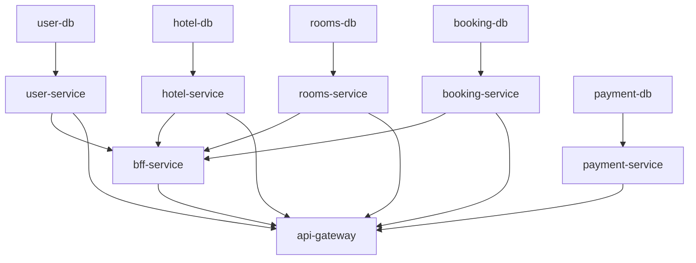

# 🐳 Infrastructure (Infra)

> Docker Compose orchestration, environment configuration, shared keys, and E2E test suite for the Hotel Reservation Platform.

## Overview

The `Infra/` directory is the **deployment root** for the entire platform. It contains the Docker Compose file that defines and connects all services, databases, and external dependencies. It also holds shared RSA keys for JWT authentication and a comprehensive E2E test suite.

## Directory Structure

```
Infra/
├── .env                    # Environment variables (DB creds, Stripe key, etc.)
├── docker-compose.yml      # Full platform orchestration (14 services)
├── keys/
│   ├── private.pem         # RSA private key (Users Service signs JWTs)
│   ├── public.pem          # RSA public key (all services verify JWTs)
│   └── readme.md
├── tests/                  # E2E integration test suite (TypeScript)
│   ├── index.ts            # Test entry point
│   ├── e2e-test-suite.ts   # End-to-end test scenarios
│   ├── main-test-suite.ts  # Main test runner
│   ├── business-scenarios.ts # Business workflow tests
│   ├── health-check.ts     # Service health verification
│   ├── test-client.ts      # HTTP client for tests
│   ├── test-config.ts      # Test configuration
│   ├── test-reporter.ts    # Test output formatting
│   ├── test-runner.ts      # Test execution engine
│   ├── assertions.ts       # Custom assertion helpers
│   ├── config-validation.ts # Config validation tests
│   ├── run-tests.ps1       # PowerShell test runner
│   ├── install.ps1         # Windows dependency installer
│   ├── install.sh          # Unix dependency installer
│   └── package.json        # Test dependencies
└── README.md
```

## Service Topology

The `docker-compose.yml` defines the following services:

| Service | Container | Port (Host:Container) | Database |
|---|---|---|---|
| API Gateway | `ApiGateway` | `8080:8080` | — |
| Users Service | `users-service` | `8081:8080` | `user-db:5433` |
| Hotel Service | `hotel-service` | `8084:8080` | `hotel-db:5435` |
| Rooms Service | `rooms-service` | `8085:8080` | `rooms-db:5436` |
| Booking Service | `booking-service` | `8086:8080` | `booking-db:5437` |
| BFF Service | `bff-service` | `8087:8080` | — |
| Payment Service | `payment-service` | `8088:8080` | `payment-db:5438` |

> **Note**: Media Service, MinIO, and their dependencies are also defined but excluded from this documentation scope.

## Health Check Strategy

All services implement a health check pattern:

- **Liveness**: `wget --spider http://localhost:8080/health`
- **Interval**: 5s
- **Timeout**: 5s
- **Retries**: 10
- **Start Period**: 30–60s

PostgreSQL databases use `pg_isready` for health checks.

## Startup Order



## Running the Platform

```bash
# Start all services
docker compose up --build

# Start in detached mode
docker compose up --build -d

# View logs
docker compose logs -f

# Stop all services
docker compose down

# Reset all data (nuclear option)
docker compose down -v
```

## Running E2E Tests

```powershell
# From Infra/tests/
.\install.ps1       # Install dependencies
.\run-tests.ps1     # Run full test suite
```
